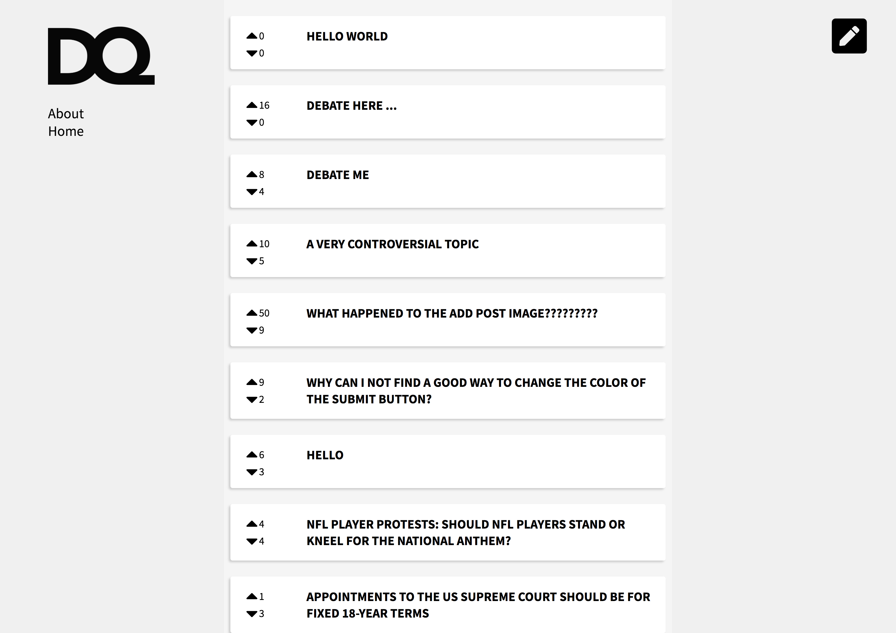

# Debate Questions
A React application that allows for posts, comments, upvotes, etc. Leverages Firebase as well as React.



## Installation
```
git clone https://github.com/JonFermin/React_Project.git
cd React_Project
npm install
```

## Running the application
```
yarn start
```

Go to [localhost:3000/](http://localhost:3000/) to see the application running. Making any change on the code will automatically reload the application.

